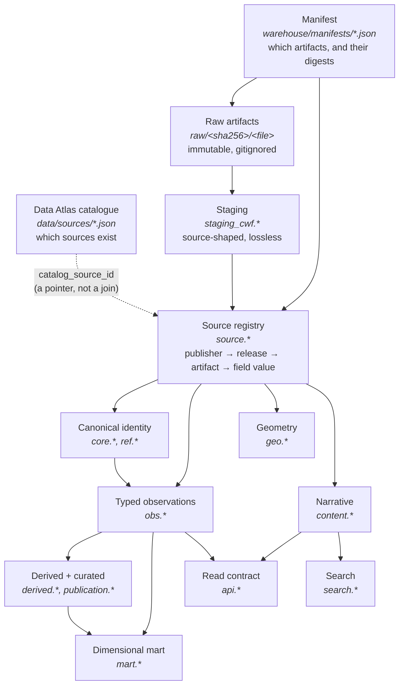

# Architecture

## The pipeline



Edges follow real foreign keys and view definitions. Note that `geo.*` and
`content.*` hang off `source.*` and `core.*`, not off `obs.*` — a coordinate and
a narrative passage are read from the same raw fields an observation is, not
derived from observations. `search` and the narrative half of `api` read
`content.*` directly.

`derived.*` and `publication.*` are **modelled but empty**: no conflict has been
resolved into a preferred value and no profile has been generated, so those
edges describe intended flow rather than current data. `warehouse/reports/`
carries the row counts.

Each stage is restartable and idempotent. Re-running `stage` for an artifact
rewrites exactly that artifact's rows; re-running `load` rewrites exactly that
release's observations.

## Layers, and what each is allowed to do

| Layer | Schemas | May be source-specific | Contains |
|---|---|---|---|
| Acquisition | — | yes | Manifests, downloader, content-addressed files |
| Staging | `staging_cwf` | **yes** | The source's own shape, uninterpreted |
| Registry | `source` | no | Provenance chain, field dictionary, mappings |
| Canonical | `core`, `ref`, `obs`, `geo`, `content` | **no** | Typed claims with provenance |
| Derived | `derived`, `publication` | no | What this platform computed or chose |
| Serving | `mart`, `api`, `search` | no | Projections; rebuildable |
| Operations | `meta` | no | Runs, quarantine, quality, curation |

The only schema permitted to look like the CIA World Factbook is `staging_cwf`.
Above it, a schema is named for what data *means*: `demo.population`, never
`cia.population`. A second dataset gets its own `staging_*` schema and reuses
everything above unchanged — that is the test of whether this generalises, and
it is the question to ask of every schema change. ADR-0001.

## Why there is no `demo` schema

The brief sketched per-domain schemas — `demo`, `econ`, `energy`, `infra` and
so on. That is not what was built, and the reasoning is worth stating because
the alternative looks tidier.

A metric's domain is a **classification of the metric**, not a property of how
its values are stored. Putting it in the schema name means reclassifying a
metric — deciding that literacy belongs to `society` rather than `demo` — becomes
a table move and a data migration, instead of an update to one row. It also
fragments queries: "every economic indicator for Czechia" becomes a union across
schemas rather than a join with a filter.

So the domain lives on `ref.metric_domain` as an `ltree` path, and the
observation core is one strongly-typed model. What *does* get explicit
relational structure is anything whose **grain** genuinely differs:

| Shape | Table | Why not a scalar observation |
|---|---|---|
| Scalar measurement | `obs.observation` + typed subtype | — |
| A breakdown into shares | `obs.composition` + `obs.composition_member` | A share is meaningless without the other members of its list |
| A fact about a pair | `obs.bilateral_observation` | Two subjects, not one |
| A published rank | `obs.source_rank` | Depends on a comparison set that is not recoverable |
| A point | `geo.entity_point` | Two correlated numbers, plus geometry |
| A passage of prose | `content.field` | Not a value; not aggregatable |

That is the boundary the brief asked to be found and documented (§37): explicit
tables where the grain differs, one typed model where it does not. ADR-0005.

## Type safety in the observation model

The mechanism, because it is the least obvious part of the schema:

```
ref.metric          declares value_kind, exposes UNIQUE (metric_id, value_kind)
obs.observation     carries value_kind, FK → (metric_id, value_kind)
                    exposes UNIQUE (observation_id, value_kind)
obs.*_observation   value_kind GENERATED constant, FK → (observation_id, value_kind)
```

An observation inherits its type from its metric and cannot contradict it; a
value row can only attach to a header of its own kind. `population = 'Tuesday'`
is refused by a foreign key, not by a validator someone might skip.

Foreign keys cannot require that a header *has* a value row, so a deferred
constraint trigger checks at commit that there is exactly one — or none, for an
observation that deliberately records an absence. Both directions are tested in
`warehouse/tests/test_schema.py`.

## Layered coverage

Normalisation is deliberately incremental (§105). The layers, and where the
corpus stands:

| Layer | Meaning | Status |
|---|---|---|
| A | Raw bytes preserved, verifiable | complete — all 38 artifacts, digest-verified |
| B | Structured staging, lossless | complete for 31 of 38 artifacts |
| C | Field dictionary | complete for what is staged |
| D | High-confidence typed canonical | see `warehouse/reports/FIELD-EVOLUTION.md` for the current mapped/unmapped split |
| E | Everything else preserved without loss | yes — every field value is in `source.field_value` |
| F | Expanding typed coverage | ongoing; adding a mapping needs no reprocessing of bytes |

The gap between C and D is large and visible in `report fields`. That is the
honest state: most of the corpus is preserved and queryable as raw text, and a
minority is typed. Adding a mapping row converts more of it without re-reading a
single byte, which is the property the layering exists to provide.

**A typed metric's history is bounded by its mappings, not by its source.** This
matters more than the headline percentage, because it is invisible in the data
itself. Mappings match a field name exactly — `source.field_mapping.field_pattern`
is compared with `=`, not as a regular expression, whatever its name suggests —
so an edition that renames a field drops out of the metric silently. The CIA
renamed `GDP (purchasing power parity)` to `Real GDP (purchasing power parity)`
in 2021. Roughly 890 values per edition exist for 2021–2025 under the new name,
none of them mapped, and `econ.gdp.ppp` therefore ends in 2019. Nothing about
that series says so: it looks exactly like a publisher that stopped reporting.

Whether the two names denote one measure is a curation question and not an
obvious yes — "real" asserts constant prices, and the later editions carry an
explicit `data are in 2017 dollars` note the earlier ones do not. It is left
unmapped rather than assumed, and recorded here so the hole is attributable.
Any consumer reading a metric as a time series should check
`warehouse/reports/FIELD-EVOLUTION.md` for the editions that actually
contributed, rather than reading absence as evidence.

**Coverage percentages are only meaningful on a freshly built database.**
`source.field_definition` is append-only: staging inserts and updates
`first_seen_year`/`last_seen_year` but never deletes, so a definition produced
by a parser version that no longer exists stays in the dictionary forever. A
long-lived development database had accumulated **19,567** definitions where the
current parsers produce **4,875** — three quarters of the denominator was debris
from parsers that had since been fixed, and every "percent of fields mapped"
computed against it understated coverage by roughly four times. The reports in
`warehouse/reports/` are regenerated from a clean rebuild for exactly this
reason.

## A known cost: staging duplicates the registry

`staging_cwf.entry_field` and `source.field_value` both hold every field's raw
text, and together they are the two largest relations in the database — see
`warehouse/reports/STORAGE.md` for the current figures. That duplication is
real and worth naming rather than glossing.

They are not the same table. Staging is **source-shaped**: section, field and
subfield are separate columns, exactly as the parser found them. The registry is
**registry-shaped**: the field is a foreign key into a dictionary whose key is
the qualified name, which is what makes the field-evolution report and the
mapping layer possible. Collapsing them would mean either losing the source's
own structure or putting a dictionary lookup in the parser's path.

If the space matters more than the audit trail, `staging_cwf.*` can be truncated
after a successful load: it is fully reproducible from the raw artifacts, and
nothing above it reads it. That is a deployment decision, not a default, and it
is not done here — keeping it means a mapping change can be re-loaded without
re-parsing 2.8 GB of archives.

## What is deliberately absent

| Not built | Why |
|---|---|
| Per-domain schemas | See above; ADR-0005 |
| TimescaleDB hypertables | Annual data on ~500 entities is not a time-series workload. ADR-0009 |
| Vector index | The embedding tables exist; no embeddings, so no index to benchmark. ADR-0010 |
| dbt / SQLMesh | The mart is seven materialised views. A transformation framework would add a dependency and a second place for logic to live, to manage less SQL than it costs. Revisit when the mart has tens of models |
| Citus, Apache AGE, Elasticsearch | No workload. ADR-0004 |
| Partitioning | `obs.observation` holds ~160k rows. Partitioning a table this size is cost with no benefit; the row count that would change that is in PERFORMANCE.md |
| A UI | Out of scope by instruction. `api.*` is the contract a UI would use |
