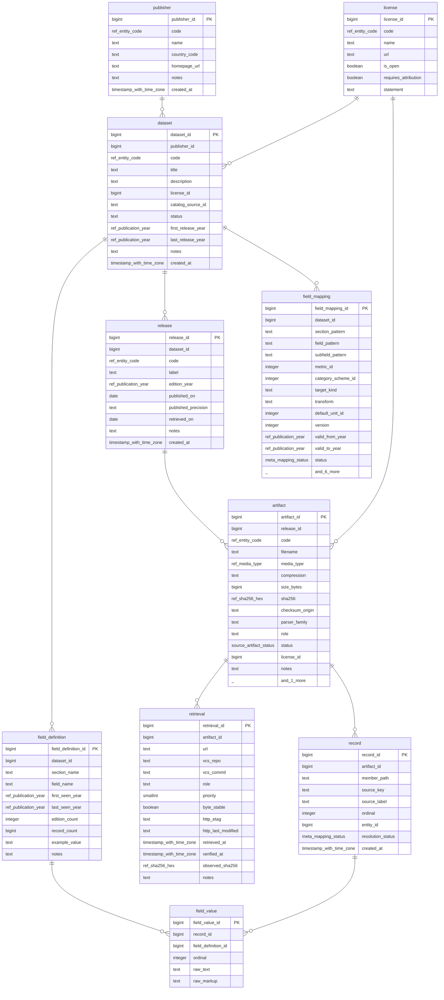
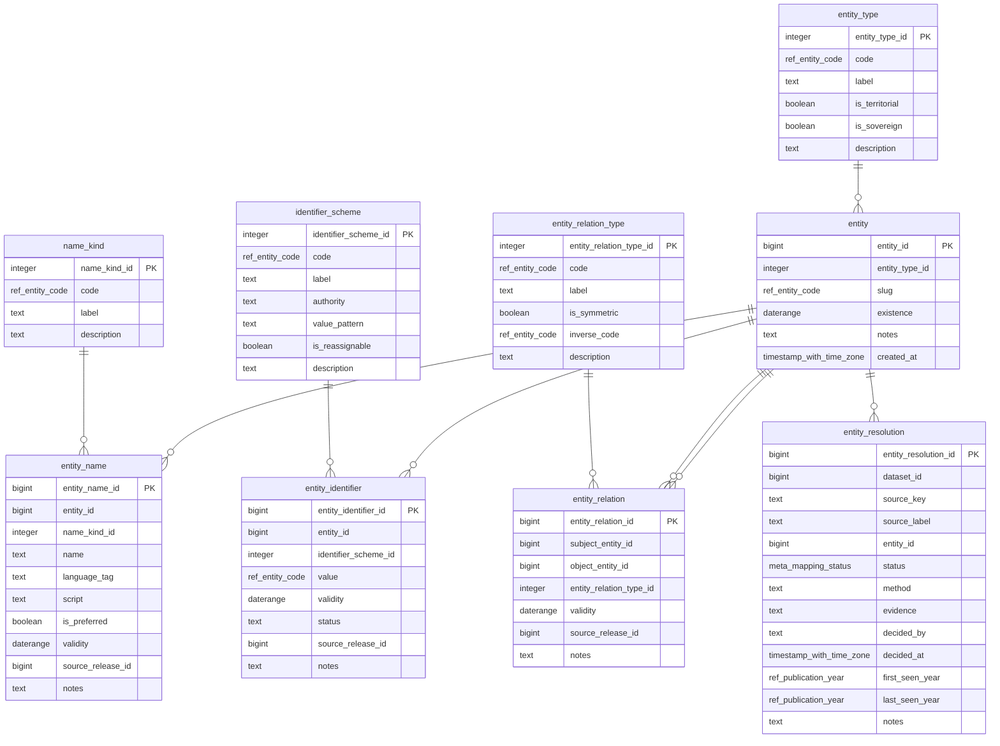
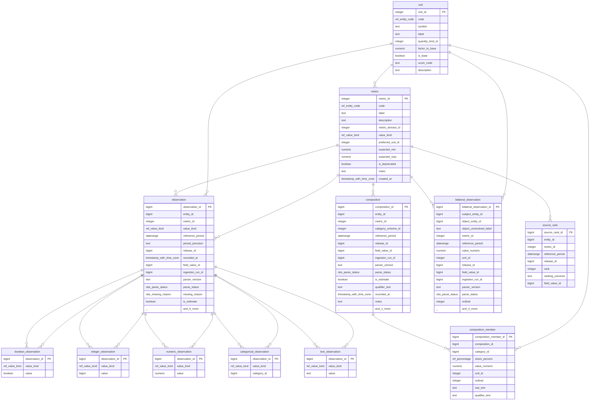

<!-- Generated by `atlas-data docs generate`. Do not edit by hand. -->

# Entity-relationship diagrams

One diagram per bounded context. A single diagram of every table would be decoration rather than documentation, so the model is split by the question each part answers. Relationships are real foreign keys read from the catalogue, not drawn by hand.

## Source and provenance

Where evidence comes from: publisher to dataset to release to the bytes, and the raw records and fields inside them.

## Canonical entity identity

Places and their names, codes and relations over time. The model that has to survive states appearing, merging and being renamed.

## Observations

Typed claims and the disjoint subtype hierarchy that keeps them typed.

## Dimensional mart

The analytics projection, generated from the canonical model.

```mermaid
erDiagram
    dim_entity {
        bigint entity_key
        ref_entity_code slug
        ref_entity_code entity_type
        text entity_type_label
        boolean is_sovereign
        boolean is_territorial
        text entity_name
        ref_entity_code iso_alpha2
        date existed_from
        date existed_until
        boolean is_current
    }
    dim_metric {
        integer metric_key
        ref_entity_code metric_code
        text metric_label
        text domain_path
        text domain_top
        text domain_label
        text value_kind
        ref_entity_code preferred_unit
        text unit_symbol
        ref_entity_code quantity_kind
        boolean is_deprecated
    }
    dim_release {
        bigint release_key
        ref_entity_code release_code
        text release_label
        ref_publication_year edition_year
        date published_on
        text published_precision
        ref_entity_code dataset_code
        text dataset_title
        text dataset_status
        ref_entity_code publisher_code
        text publisher_name
    }
    dim_period {
        date period_key
        integer year
        integer quarter
        integer month
        text year_month
        boolean is_year_start
    }
    fact_observation {
        bigint observation_key
        bigint entity_key
        integer metric_key
        bigint release_key
        date period_key
        integer reference_year
        ref_publication_year edition_year
        numeric value
        ref_entity_code unit_code
        boolean is_estimate
        text parse_status
        text period_precision
        boolean is_missing
        text missing_reason
    }
    fact_composition {
        bigint composition_member_key
        bigint composition_key
        bigint entity_key
        integer metric_key
        bigint release_key
        date period_key
        integer reference_year
        ref_entity_code scheme_code
        ref_entity_code category_code
        text category_label
        boolean is_residual
        ref_percentage share_percent
        integer ordinal
    }
    fact_bilateral {
        bigint bilateral_key
        bigint subject_entity_key
        bigint object_entity_key
        text object_unresolved_label
        integer metric_key
        bigint release_key
        date period_key
        integer reference_year
        numeric value
        ref_entity_code unit_code
        boolean object_resolved
    }
```

